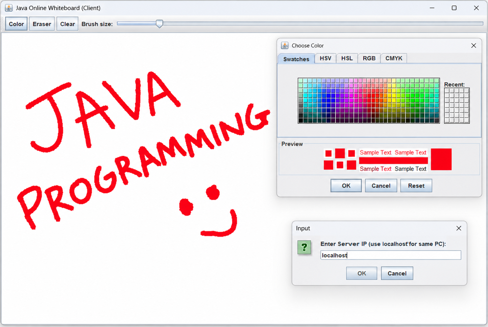

# 🎨 Java Online Whiteboard

A Java-based real-time collaborative whiteboard application that allows multiple users to draw on a shared canvas through a client-server network connection.

## 📌 Project Overview

This project demonstrates how Java socket programming can be used to build a simple real-time collaborative application.

A central server accepts multiple client connections. When a user draws on the whiteboard, the drawing information is sent to the server and broadcast to the connected clients so that the drawing can be synchronized across the sessions.

## ✨ Features

- 🖌️ Real-time collaborative drawing
- 👥 Multiple client connections
- 🌐 TCP socket communication
- 🎨 Color selection
- 🧽 Eraser mode
- 🗑️ Clear whiteboard
- 📏 Adjustable brush size
- 🔄 Real-time drawing synchronization
- 🖥️ Java desktop GUI

## 🛠️ Technologies Used

- Java
- Java Swing
- Java AWT
- TCP/IP Socket Programming
- Multithreading
- Object Serialization

## 🏗️ Architecture

```text
              ┌─────────────────────┐
              │  Whiteboard Server  │
              │      Port 5000      │
              └──────────┬──────────┘
                         │
          ┌──────────────┼──────────────┐
          │              │              │
          ▼              ▼              ▼
     ┌─────────┐    ┌─────────┐    ┌─────────┐
     │ Client 1│    │ Client 2│    │ Client 3│
     └─────────┘    └─────────┘    └─────────┘
```

## 🔄 How It Works

1. Start the `WhiteboardServer`.
2. The server listens for TCP connections on port `5000`.
3. Each client connects using the server IP address.
4. A client draws on the whiteboard using the mouse.
5. The drawing coordinates, color, and brush size are stored in a `Message` object.
6. The message is sent to the server using object serialization.
7. The server broadcasts the message to connected clients.
8. Each client displays the received drawing on its canvas.

## 📂 Project Structure

```text
java-online-whiteboard/
├── src/
│   ├── Message.java
│   ├── WhiteboardClient.java
│   └── WhiteboardServer.java
├── .github/
│   ├── ISSUE_TEMPLATE/
│   │   ├── bug_report.md
│   │   └── feature_request.md
│   └── pull_request_template.md
├── CODE_OF_CONDUCT.md
├── CONTRIBUTING.md
├── LICENSE
├── SECURITY.md
├── README.md
└── screenshot.png
```

## ▶️ How to Run

### Requirements

- Java JDK 8 or later
- Two or more computers on the same network for multi-device testing, or multiple client instances on one computer

### 1. Clone the repository

```bash
git clone https://github.com/gurusaeth12/java-online-whiteboard.git
cd java-online-whiteboard
```

### 2. Compile the project

```bash
javac src/*.java
```

### 3. Start the server

```bash
java -cp src WhiteboardServer
```

The server listens on port `5000`.

### 4. Start a client

Open another terminal:

```bash
java -cp src WhiteboardClient
```

Enter:

- `localhost` when the server and client are on the same computer
- The server computer's local IP address when connecting from another computer on the same network

### 5. Connect multiple clients

Start additional client instances and use the same server address. Drawing from one client will be broadcast to the connected clients.

## 🖼️ Project Preview



## 🎯 Learning Outcomes

- Client-server architecture
- Java GUI development
- TCP socket programming
- Multithreading
- Object serialization
- Network communication
- Event-driven programming
- Real-time data synchronization

## 🔮 Future Improvements

- User names and authentication
- Undo and redo
- Save whiteboard as an image
- Chat functionality
- Private whiteboard rooms
- Improved connection handling
- Persistent whiteboard sessions
- Better user feedback for connection errors

## 👨‍💻 Author

**Gurusaeth**

GitHub: https://github.com/gurusaeth12

---

⭐ If you find this project useful, consider giving it a star.
